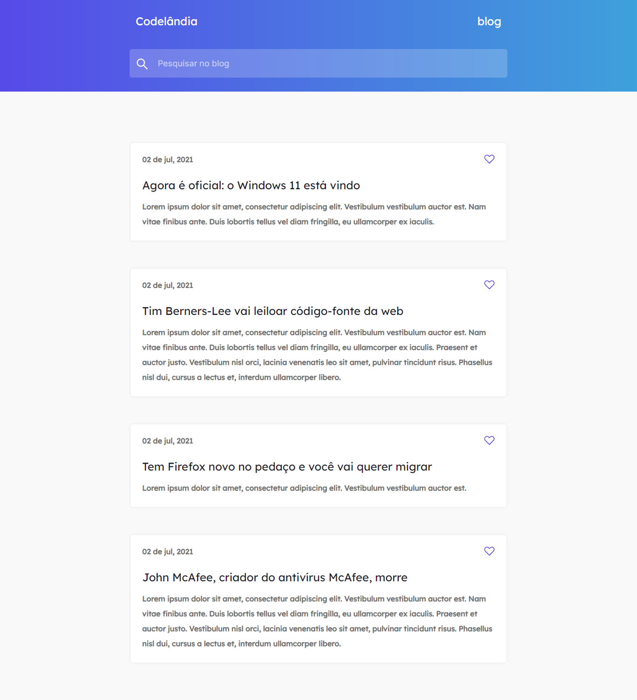

# Desafio 1 da comunidade Codelândia no Discord

## 💻 _Blog_

Repositório criado para armazenar o desafio 1 proposto por Iuri Silva criador da comunidade Codelândia no Discord.\

## 💻  Projeto desenvolvido
[Acesse o projeto](https://ifzohan.github.io/blog/)

## 👨‍💻 Autor

Gabriel Dias Catarin, desenvolvedor front-end | Bauru, São Paulo

[ LinkedIn](https://www.linkedin.com/in/gabriel-dias-260857207/)
&nbsp;
